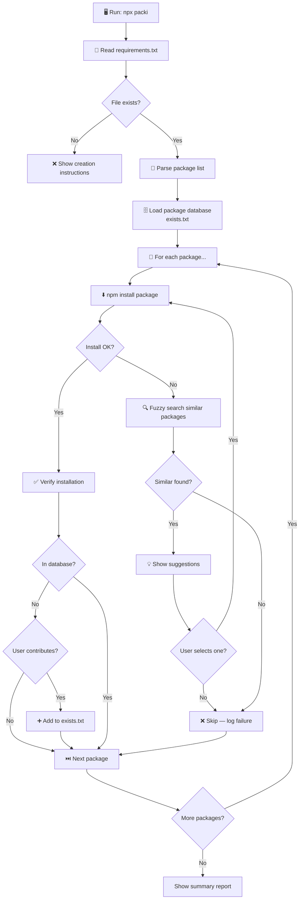

<div align="center">

#  packi

**Smart CLI package installer for Node.js**

[](https://www.npmjs.com/package/packi)
[](./LICENSE)
[](https://nodejs.org)
[](https://github.com/ThorLex/packInstaller)

> Install all your npm dependencies from a `requirements.txt` in one command — with fuzzy-match suggestions, progress tracking, and a community-powered package database.

</div>

---

##  Features

| Feature | Description |
|---|---|
|  **`requirements.txt` support** | List your packages the Python way — one per line |
|  **Fuzzy search & suggestions** | Typo in a package name? `packi` finds the closest match |
|  **Progress bar** | Real-time installation progress displayed in your terminal |
|  **Community package database** | A local database (`exists.txt`) grows with contributions from users |
|  **Persistent config** | One-time contribution preference saved in `.package-installer-config.json` |
|  **Alternative installer** | When a package fails, choose an alternative from suggestions interactively |
|  **Zero native deps** | Only one runtime dependency: `string-similarity` |

---

##  How it works



---

##  Installation

### Use without installing (recommended for one-time use)

```bash
npx packi
```

### Install globally

```bash
npm install -g packi
```

### Install locally in a project

```bash
npm install packi
```

---

##  Usage

### 1. Create your `requirements.txt`

You can create the file manually:

```
express
lodash
axios
chalk
dotenv
```

> One package name per line. Lines starting with `#` are treated as comments. The format `package@version` is also supported.

Or use **`packi freeze`** to generate it automatically from your project:

```bash
packi freeze
# or
npx packi freeze
```

This scans your `package.json` and installed `node_modules` to produce a `requirements.txt` — similar to Python's `pip freeze`.

> **Note:** If `requirements.txt` doesn't exist when you run `packi`, it will be auto-generated from `package.json` if available.

### 2. Run packi

```bash
packi
# or
npx packi
```

### 3. Watch the magic 

```
=== Début de l'installation ===
Nombre total de packages à installer: 3

[14:22:01] 📍 Chargement de la base de données des packages

   Tentative d'installation de express
  express installé avec succès

[████████████░░░░░░░░░░░░░░░░░░░░░░░░░░░░] 33.3%

   Tentative d'installation de lodash
  lodash installé avec succès

[████████████████████████░░░░░░░░░░░░░░░░] 66.7%

...

=== Résumé de l'installation ===
  Durée totale: 8.42 secondes
 Packages installés avec succès: 3
 Échecs d'installation: 0
```

---

##  Configuration

packi creates a `.package-installer-config.json` in your working directory to remember your contribution preference:

```json
{
  "willContribute": true,
  "gms": "npm"
}
```

| Key | Type | Description |
|---|---|---|
| `willContribute` | `boolean` | Whether to add newly installed packages to the shared database |
| `gms` | `string` | Package manager to use (currently `npm`) |

---

##  Why use packi?

### One command to install everything

No more copy-pasting package names one by one. List them all in `requirements.txt` and let packi handle the rest.

###  Fuzzy matching saves you from typos

Made a mistake?

```
axois   # typo!
```

packi detects the error and suggests:

```
  Échec de l'installation de axois
  Suggestions de packages similaires:
   1. axios (2,500,000 téléchargements) - Similarité: 83.3%
   2. axos  (12,000 téléchargements)   - Similarité: 57.1%
```

###  Community-powered package database

Every time you install a new package, you can add it to the local database. Over time, the suggestion engine gets smarter for your whole team.

###  Full visibility

See exactly what's happening at every step, with timestamps, progress bars, and a final summary.

---

##  Project structure

```
packInstaller/
├── index.js                         #  Main CLI entry point
├── exists.txt                       #  Community package database
├── requirements.txt                 #  Your packages to install (user-created)
├── .package-installer-config.json  #  Persistent user config (auto-generated)
├── package.json                     #  npm module metadata
└── README.md                        #  This file
```

---

##  Contributing

Contributions are welcome! Here's how:

1. **Fork** the repository
2. **Create** a feature branch: `git checkout -b feat/my-feature`
3. **Commit** your changes: `git commit -m "feat: add my feature"`
4. **Push**: `git push origin feat/my-feature`
5. **Open a Pull Request** on GitHub

---

##  Contact

| Channel | Link |
|---|---|
|  **Email** | [b.galaxy.dev@gmail.com](mailto:b.galaxy.dev@gmail.com) |
|  **GitHub** | [github.com/ThorLex](https://github.com/ThorLex) |
|  **Issues** | [github.com/ThorLex/packInstaller/issues](https://github.com/ThorLex/packInstaller/issues) |
|  **npm** | [npmjs.com/package/packi](https://www.npmjs.com/package/packi) |

---

##  License

MIT © [Bekono Beyas Ambroise (ThorLex)](https://github.com/ThorLex)

---

<div align="center">

Made with ❤️ by <a href="https://github.com/ThorLex">ThorLex</a> · <a href="mailto:b.galaxy.dev@gmail.com">b.galaxy.dev@gmail.com</a>

</div>
