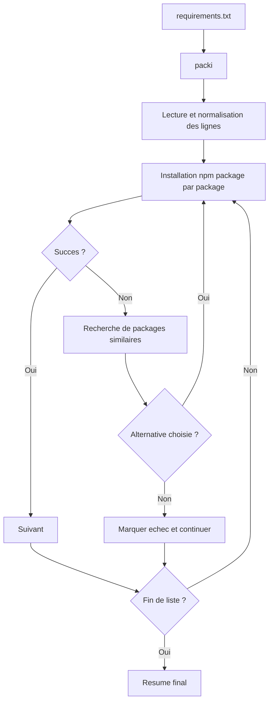

# packi

packi est un CLI Node.js qui automatise l'installation des dependances depuis un fichier requirements.txt, avec un objectif clair : reduire les echecs d'installation et garder un flux de travail robuste, meme quand la connexion reseau est instable.

Package npm officiel : https://www.npmjs.com/package/@beyas/packi

## Pourquoi packi

Dans de nombreux projets, l'installation des dependances echoue pour des raisons reseau : timeout, coupure intermittente, perte temporaire de DNS, ou registre npm lent.

packi apporte une approche operationnelle :
- installation en lot a partir d'un fichier simple
- poursuite du traitement package par package
- detection des erreurs de nom de package
- suggestions automatiques pour corriger rapidement les fautes
- resume final exploitable en local et en CI

## Vue d'ensemble



## Installation

### Sans installation globale

```bash
npx @beyas/packi
```

### Installation globale

```bash
npm install -g @beyas/packi
packi
```

### Installation locale au projet

```bash
npm install --save-dev @beyas/packi
npx @beyas/packi
```

## Commandes CLI

### Commande principale

```bash
packi
# ou
npx @beyas/packi
```

Ce que fait la commande :
1. Lit requirements.txt dans le dossier courant.
2. Si le fichier est absent, tente une generation depuis package.json.
3. Charge exists.txt pour les suggestions.
4. Lance npm install package par package.
5. Continue meme si certains packages echouent.
6. Affiche un bilan final.

### Generation du fichier requirements.txt

```bash
packi freeze
# ou
npx @beyas/packi freeze
```

Cette commande genere ou met a jour requirements.txt en se basant sur les dependances detectees dans le projet.

## Strategie recommandee en reseau instable

packi gere deja la continuite du traitement package par package. Pour durcir encore votre pipeline, combinez-le avec une configuration npm orientee reseau.

### Parametres npm conseilles

```bash
npm config set fetch-retries 5
npm config set fetch-retry-factor 2
npm config set fetch-retry-mintimeout 20000
npm config set fetch-retry-maxtimeout 120000
npm config set network-timeout 300000
```

### Execution robuste

```bash
npx @beyas/packi || npx @beyas/packi
```

Le second passage termine souvent les packages qui ont echoue lors de la premiere tentative reseau.

## Format requirements.txt

```text
# framework
express

# utilitaires
lodash
chalk

# version fixe
axios@1.7.9
```

Regles :
- un package par ligne
- lignes vides ignorees
- lignes commencant par # ignorees
- notation package@version acceptee

## Architecture du projet

```text
packInstaller/
├── cli.js
├── exists.txt
├── requirements.txt
├── src/
│   ├── classes/
│   │   ├── ConfigManager.js
│   │   ├── InstallationLogger.js
│   │   └── PackageDatabase.js
│   ├── commands/
│   │   ├── freeze.js
│   │   └── install.js
│   └── utils/
│       ├── cli-helpers.js
│       └── npm-commands.js
└── docs/
```

## Cas d'usage CI

```bash
npx @beyas/packi
```

Puis interpretation du code de sortie dans votre pipeline.

## Liens

- npm : https://www.npmjs.com/package/@beyas/packi
- GitHub : https://github.com/ThorLex/packInstaller
- Issues : https://github.com/ThorLex/packInstaller/issues

## Licence

MIT
