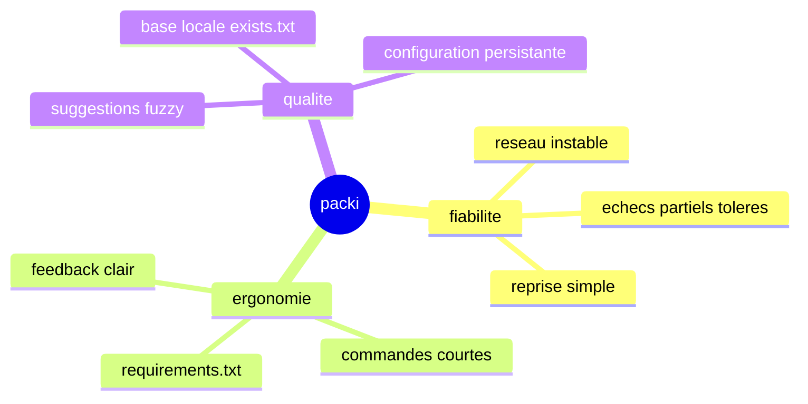

# A propos de packi

packi est ne d'un probleme concret : les installations npm qui cassent en environnement reseau imparfait.

## Vision

Offrir une commande unique pour installer un ensemble de dependances de maniere plus resiliente et plus lisible qu'une succession manuelle de npm install.

## Objectifs du projet

1. Rendre l'installation par lot simple avec requirements.txt.
2. Limiter l'impact des echecs reseau ponctuels.
3. Accelerer la correction des erreurs de nom de package.
4. Conserver un resultat exploitable en CI/CD.

## Ce que packi fait aujourd'hui

- orchestrer l'installation package par package
- continuer le traitement meme apres certains echecs
- suggerer des alternatives via similarite
- fournir un resume final clair

## Ce que packi peut evoluer demain

- politique de retry integree par package
- support multi gestionnaire (npm, pnpm, yarn)
- mode non interactif avance pour CI
- rapports structurés JSON

## Carte conceptuelle

## Liens

- npm : https://www.npmjs.com/package/@beyas/packi
- GitHub : https://github.com/ThorLex/packInstaller
- Issues : https://github.com/ThorLex/packInstaller/issues
