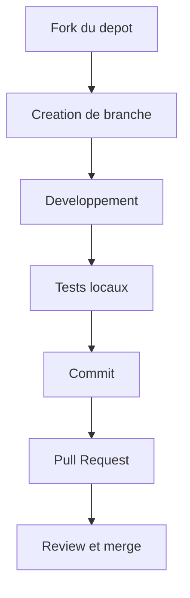

# Contribuer a packi

Le projet accepte les contributions code, documentation et amelioration de la base exists.txt.

## Parcours de contribution



## Contribution code

```bash
git clone https://github.com/VOTRE-USERNAME/packInstaller.git
cd packInstaller
git checkout -b feat/amelioration-reseau
npm install
node cli.js
```

## Convention de branches

- feat/... pour nouvelles fonctionnalites
- fix/... pour corrections
- docs/... pour documentation
- refactor/... pour refactorisation

## Convention de commits

Exemples :
- feat: add retry strategy for transient npm failures
- fix: handle empty requirements line parsing
- docs: expand network troubleshooting guide

## Contribution de la base exists.txt

Regles :
- un package valide par ligne
- pas de doublons
- pas de packages deprecies evidents

## Contribution documentation

```bash
pip install mkdocs mkdocs-material
mkdocs serve
```

## Bonnes pratiques PR

- expliquer le probleme et la solution
- decrire comment tester
- garder des commits lisibles
