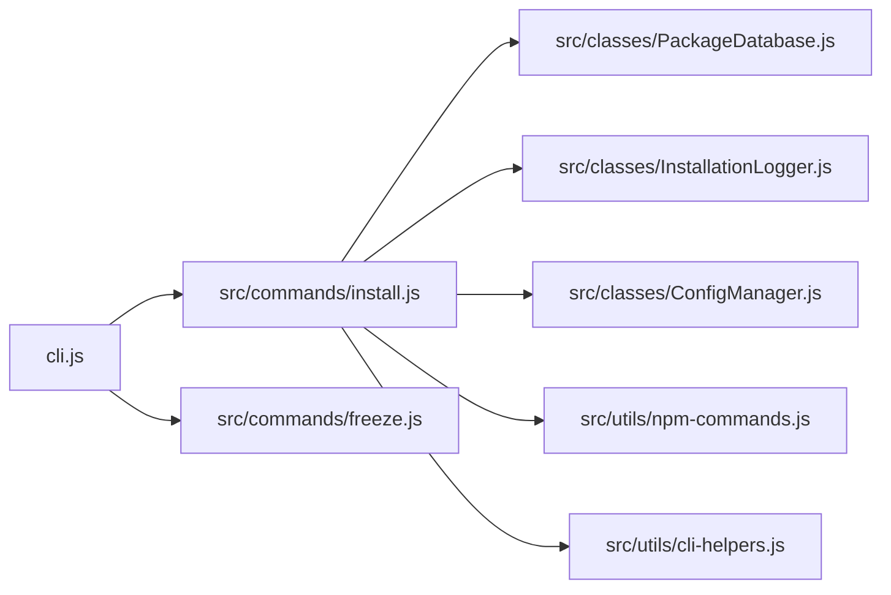
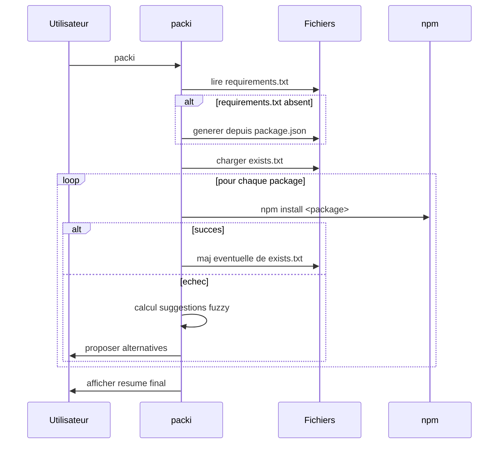
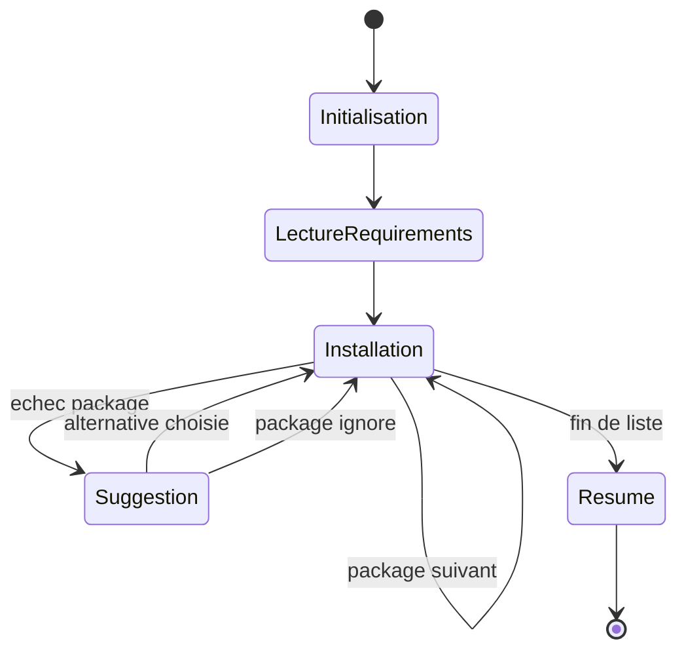

# Fonctionnement interne

Cette page detaille le pipeline technique de packi.

## Architecture logicielle



## Cycle d'execution de la commande packi



## Machine d'etats simplifiee



## Gestion des erreurs reseau

packi s'appuie sur npm pour la couche transport et applique une strategie de robustesse au niveau orchestration :
- poursuite du traitement des packages suivants
- conservation des echecs dans le resume final
- possibilite de relance simple de la commande

## Recommandation operationnelle

Pour connexion fragile, combiner packi avec des retries npm :

```bash
npm config set fetch-retries 5
npm config set fetch-retry-factor 2
npm config set fetch-retry-mintimeout 20000
npm config set fetch-retry-maxtimeout 120000
```
