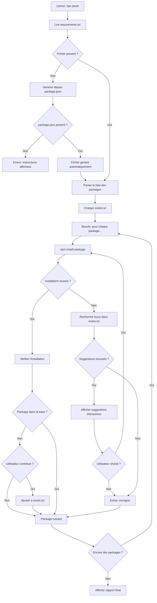

# Fonctionnement interne

Cette page decrit le fonctionnement technique de `packi` : architecture, flux de traitement, et mecanismes internes.

---

## Flux global d'execution



---

## Architecture du code

```
packInstaller/
├── index.js                         # Entree principale du CLI
├── exists.txt                       # Base de donnees packages
├── requirements.txt                 # Packages a installer (cree par l'utilisateur)
├── .package-installer-config.json  # Config persistante (auto-generee)
└── package.json                     # Metadonnees npm
```

### `index.js` — Point d'entree

C'est le fichier principal qui orchestre tout le processus. Il contient :

- La lecture et le parsing de `requirements.txt`
- La boucle d'installation avec suivi de progression
- La logique de recherche fuzzy via `string-similarity`
- La gestion de la configuration persistante
- L'affichage du rapport final

---

## Mecanismes cles

### 1. Parsing du fichier requirements.txt

`packi` lit `requirements.txt` ligne par ligne et applique ces regles :

| Ligne              | Traitement                              |
| ------------------ | --------------------------------------- |
| `express`          | Installe la derniere version            |
| `express@4.18.2`   | Installe la version exacte              |
| `# commentaire`    | Ignoree                                 |
| *(ligne vide)*     | Ignoree                                 |

### 2. Barre de progression

La progression est calculee en temps reel :

```
packages_installes / total_packages * 100
```

Affichee sous forme de barre ASCII mise a jour apres chaque installation.

### 3. Recherche fuzzy

Algorithme utilise : **Dice coefficient** via `string-similarity`.

```
score = (2 * lettres_communes) / (longueur_A + longueur_B)
```

Seuls les resultats dont le score depasse un **seuil minimal** sont presentes comme suggestions.

### 4. Configuration persistante

Le fichier `.package-installer-config.json` evite de reposer les memes questions a chaque execution. Il est lu au demarrage et mis a jour au besoin.

---

## Dependances du projet

`packi` est volontairement minimaliste :

| Dependance         | Version  | Role                                            |
| ------------------ | -------- | ----------------------------------------------- |
| `string-similarity`| `^4.0.4` | Calcul de similarite entre noms de packages     |

Toutes les autres fonctionnalites utilisent les **modules natifs de Node.js** :
`fs`, `path`, `child_process`, `readline`.

---

## Securite

- `packi` n'envoie aucune donnee a un serveur externe
- Toutes les operations sont locales (lecture/ecriture de fichiers, appels `npm install`)
- Le fichier `exists.txt` reste sur votre machine, sauf si vous le committez vous-meme

!!! success "Confidentialite totale"
    Vos listes de packages ne quittent jamais votre environnement local.
