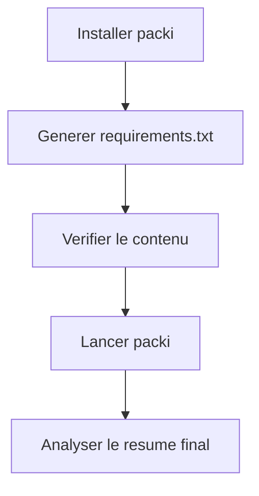

# Installation et prise en main

Cette page explique comment installer et executer @beyas/packi en local, en global et en CI.

## Prerequis

- Node.js >= 14
- npm disponible dans le PATH

Verification :

```bash
node --version
npm --version
```

## Methode 1 : execution directe sans installation

```bash
npx @beyas/packi
```

Quand utiliser cette methode :
- essais ponctuels
- pipeline CI simple
- poste de travail sans installation globale

## Methode 2 : installation globale

```bash
npm install -g @beyas/packi
packi
```

Quand utiliser cette methode :
- usage quotidien
- scripts shell locaux

## Methode 3 : installation locale projet

```bash
npm install --save-dev @beyas/packi
npx @beyas/packi
```

Quand utiliser cette methode :
- aligner la version de l'outil par projet
- standardiser l'environnement d'equipe

## Verification fonctionnelle

```bash
npx @beyas/packi freeze
npx @beyas/packi
```

## Flux de prise en main


