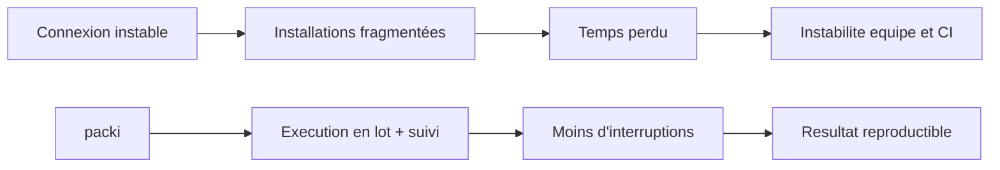

# Documentation packi

packi est un CLI orienté fiabilite d'installation. Son objectif est de reduire l'impact des problemes reseau pendant l'installation de dependances npm, tout en gardant une experience simple et scriptable.

## Positionnement

packi ne remplace pas npm. Il orchestre npm pour rendre les installations en lot plus robustes :
- lecture d'une liste declarative de dependances
- execution package par package
- tolerance aux echecs partiels
- suggestions automatiques en cas de faute de nom

## Schema de valeur



## Demarrage rapide

```bash
npx @beyas/packi
```

## Contenu de la documentation

- [Installation et prise en main](home/index.md)
- [Vision et objectifs](home/about.md)
- [Fonctionnement detaille](home/fonctionnement.md)
- [Utilisation pratique](utilisation/index.md)
- [Commandes CLI](utilisation/commandes.md)
- [Generation requirements.txt](utilisation/freeze.md)
- [Format requirements.txt](utilisation/requirements.md)
- [Configuration](reference/configuration.md)
- [Base de suggestions](reference/database.md)
- [Contribution](home/contribuer.md)
