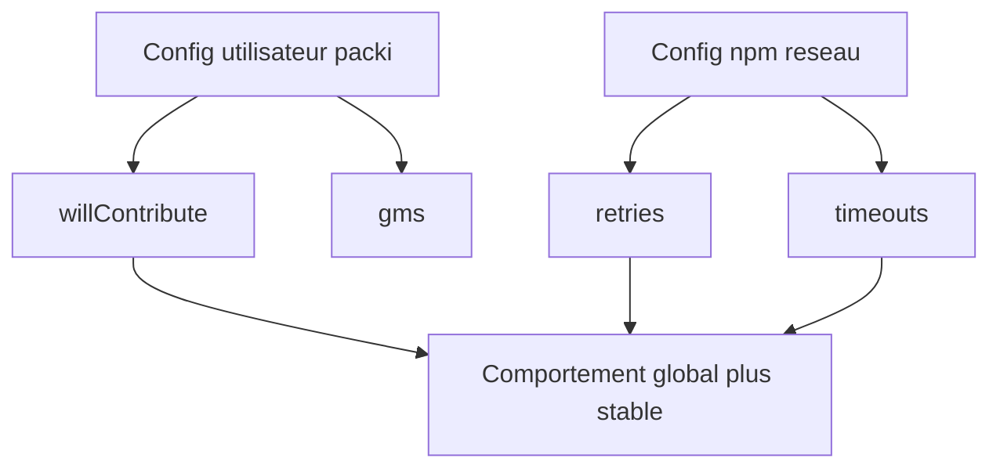

# Configuration

packi utilise une configuration locale pour memoriser certaines preferences utilisateur.

## Fichier local

- .package-installer-config.json

Exemple :

```json
{
  "willContribute": true,
  "gms": "npm"
}
```

## Parametres

### willContribute

- type : boolean
- effet : autorise l'ajout automatique des nouveaux packages dans exists.txt

### gms

- type : string
- valeur actuelle supportee : npm

## Configuration npm recommandee en reseau instable

Ajoutez aussi ces reglages npm pour reduire les echecs transitoires :

```bash
npm config set fetch-retries 5
npm config set fetch-retry-factor 2
npm config set fetch-retry-mintimeout 20000
npm config set fetch-retry-maxtimeout 120000
npm config set network-timeout 300000
```

## Schema de configuration


