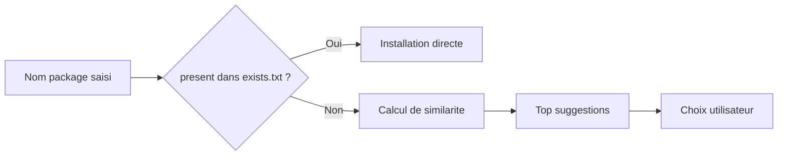

# Base de donnees locale exists.txt

exists.txt est la base locale utilisee par packi pour proposer des corrections de noms de package.

## Role de exists.txt

- stocker les packages deja connus
- accelerer la correction des fautes de frappe
- enrichir la qualite des suggestions au fil du temps

## Format

```text
1. [axios](https://www.npmjs.org/package/axios) - 0
2. [express](https://www.npmjs.org/package/express) - 0
```

## Utilisation dans le flux



## Qualite des donnees

Recommandations :
- conserver un format strict
- eviter les doublons
- verifier les noms sur npm

## Strategie collaborative

- versionner exists.txt si l'equipe veut mutualiser les suggestions
- revoir periodiquement les entrees non pertinentes
