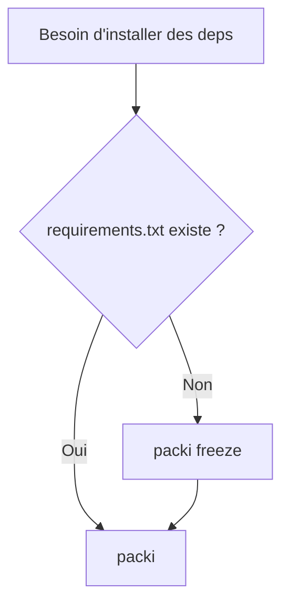

# Commandes disponibles

Reference complete des commandes CLI de @beyas/packi.

## packi

Installe les packages listes dans requirements.txt.

```bash
packi
# ou
npx @beyas/packi
```

### Etapes internes

1. Lecture requirements.txt.
2. Fallback auto depuis package.json si necessaire.
3. Chargement exists.txt.
4. npm install package par package.
5. Suggestions fuzzy en cas d'echec.
6. Resume final.

### Exemples pratiques

```bash
# execution standard
npx @beyas/packi

# execution robuste en connexion instable
npx @beyas/packi || npx @beyas/packi
```

## packi freeze

Genere ou met a jour requirements.txt.

```bash
packi freeze
# ou
npx @beyas/packi freeze
```

### Etapes internes

1. Lecture des dependances dans package.json.
2. Analyse des packages installes detectables.
3. Ecriture d'un requirements.txt trie.

## Tableau recapitulatif

| Commande | But | Sortie principale |
|---|---|---|
| packi | Installer les dependances | Resume de succes et echecs |
| packi freeze | Produire requirements.txt | Fichier requirements.txt a jour |

## Diagramme de decision


