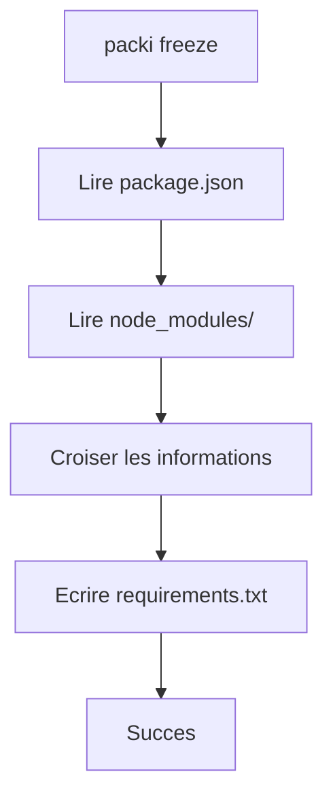

# Commande freeze

La commande `packi freeze` vous permet de generer automatiquement un fichier `requirements.txt` depuis votre projet Node.js existant — a l'image de `pip freeze` en Python.

---

## Utilisation

```bash
packi freeze
# ou
npx packi freeze
```

---

## Comment ca fonctionne ?

`packi freeze` analyse deux sources d'information dans votre projet :

1. **`package.json`** — pour lire la liste des dependances declarees (`dependencies` et `devDependencies`)
2. **`node_modules/`** — pour verifier quels packages sont reellement installes et leur version exacte

Il produit ensuite un `requirements.txt` avec les packages installes.



---

## Exemple

Supposons ce `package.json` :

```json title="package.json"
{
  "dependencies": {
    "express": "^4.18.2",
    "axios": "^1.4.0",
    "lodash": "^4.17.21"
  },
  "devDependencies": {
    "nodemon": "^3.0.1"
  }
}
```

Apres avoir execute `packi freeze`, vous obtenez :

```text title="requirements.txt (genere)"
express@4.18.2
axios@1.4.0
lodash@4.17.21
nodemon@3.0.1
```

---

## Cas particuliers

### `requirements.txt` existe deja

Si un fichier `requirements.txt` existe deja dans votre repertoire, `packi freeze` vous demandera confirmation avant de l'ecraser :

```
  requirements.txt existe deja.
  Voulez-vous l'ecraser ? (o/n) :
```

!!! warning "Attention"
    Repondre **`o`** remplacera definitivement le fichier existant. Pensez a sauvegarder votre version actuelle si necessaire.

### `package.json` absent

Si aucun `package.json` n'est trouve dans le repertoire courant, `packi freeze` affiche un message d'erreur et vous indique comment creer le fichier :

```
  Aucun package.json trouve dans ce repertoire.
  Initialisez votre projet avec : npm init
```

### `node_modules/` absent

Si les modules ne sont pas installes, `packi freeze` genere quand meme le fichier depuis `package.json`, mais sans les versions exactes :

```text title="requirements.txt (sans node_modules)"
express
axios
lodash
nodemon
```

---

## Difference avec `npm list`

| Critere              | `packi freeze`          | `npm list`                          |
| -------------------- | ----------------------- | ------------------------------------ |
| Sortie               | `requirements.txt`      | Affichage terminal (arborescence)    |
| Format               | Un package par ligne    | Arbre de dependances                 |
| Usage avec packi     | Direct                  | Necessite un reformatage manuel      |
| Sous-dependances     | Non (direct seulement)  | Oui (toutes les dependances)         |

---

## Workflow recommande

Voici le workflow ideal pour partager un projet avec votre equipe :

```bash
# 1. Initialisez votre projet et installez vos packages normalement
npm init -y
npm install express axios lodash

# 2. Gelez les dependances dans requirements.txt
packi freeze

# 3. Committez requirements.txt avec votre code
git add requirements.txt
git commit -m "chore: add requirements.txt"

# 4. Votre collegue clone le projet et installe tout d'un coup
git clone <url>
npx packi
```

!!! tip "Versionner requirements.txt"
    Incluez toujours `requirements.txt` dans votre depot Git. C'est ce fichier qui permet a n'importe qui de reconstruire l'environnement exactement comme le votre, en une commande.
