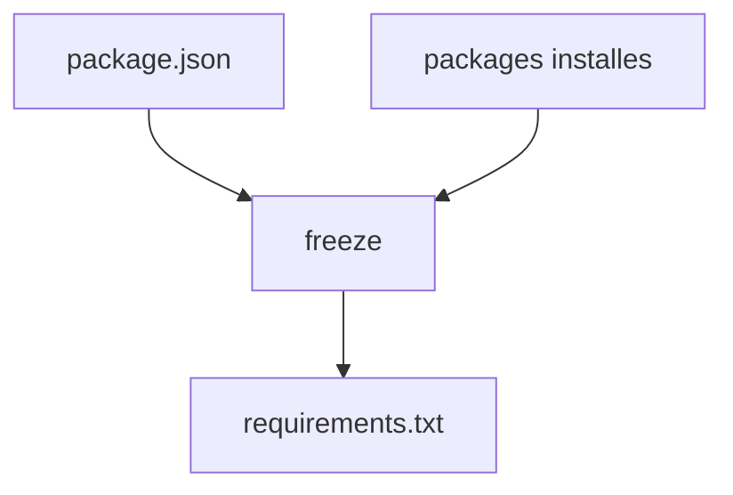

# Commande freeze

packi freeze cree un requirements.txt exploitable pour les installations en lot.

## Usage

```bash
packi freeze
# ou
npx @beyas/packi freeze
```

## Entrees utilisees

- package.json (dependencies et devDependencies)
- etat local des packages installes

## Sortie produite

```text
axios@1.7.9
chalk@5.3.0
string-similarity@4.0.4
```

## Schema



## Quand l'utiliser

- apres ajout de nouvelles dependances
- avant commit pour standardiser l'equipe
- avant execution CI qui utilisera packi
