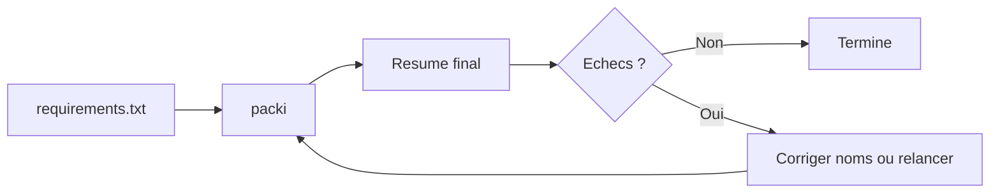

# Utilisation

Cette section couvre l'usage de packi en local, en equipe et en CI.

## Workflow standard

1. Generer ou maintenir requirements.txt.
2. Lancer packi pour installer le lot.
3. Relancer une seconde fois si la connexion a ete instable.
4. Analyser le resume final et corriger les echecs restants.

## Schema d'exploitation



## Profil connexion instable

Commande recommandee :

```bash
npx @beyas/packi || npx @beyas/packi
```

Cette approche permet de finaliser les packages qui ont echoue de maniere transitoire.

## Pages associees

- [Commandes CLI](commandes.md)
- [Commande freeze](freeze.md)
- [Format requirements.txt](requirements.md)
