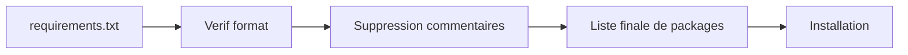

# requirements.txt

requirements.txt est le contrat d'installation de packi.

## Syntaxe

```text
# commentaires autorises
express
lodash
axios@1.7.9
```

Regles :
- un package par ligne
- lignes vides ignorees
- lignes # ignorees
- package@version supporte

## Bonnes pratiques reseau instable

- fixer les versions critiques
- eviter les packages obsoletes
- garder un fichier propre et dedoublonne

## Exemple structure equipe

```text
# core
express
dotenv

# data
mongoose
redis

# tooling
nodemon
```

## Schema de validation avant installation


